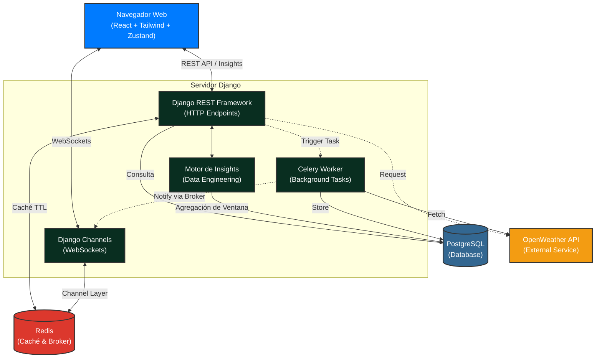

# Weather Real-Time Dashboard · Enersinc ETRM Platform

> Solución Full Stack de nivel producción para la consulta, comparación y análisis de datos climáticos en tiempo real, construida bajo los lineamientos corporativos de Enersinc.

---

## Tabla de Contenidos

1. [Arquitectura del Sistema](#arquitectura-del-sistema)
2. [Decisiones Técnicas](#decisiones-técnicas)
3. [Stack Tecnológico](#stack-tecnológico)
4. [Estructura del Proyecto](#estructura-del-proyecto)
5. [Instrucciones de Ejecución](#instrucciones-de-ejecución)
6. [API Reference](#api-reference)
7. [Funcionalidades Implementadas](#funcionalidades-implementadas)
8. [Resiliencia y Manejo de Errores](#resiliencia-y-manejo-de-errores)
9. [Seguridad](#seguridad)
10. [Pruebas](#pruebas)
11. [Demo](#demo)

---

## Arquitectura del Sistema

El sistema sigue una arquitectura orientada a servicios con separación estricta de responsabilidades entre capas. El flujo principal de datos es:

```
Frontend (React) → REST API (DRF) → Redis Cache → PostgreSQL → OpenWeather API
                ↕
         WebSocket (Django Channels) — tiempo real
```

### Diagrama de Componentes



---

## Decisiones Técnicas

Esta sección documenta el razonamiento detrás de cada elección tecnológica relevante. Se valoró la claridad en las decisiones sobre la complejidad innecesaria.

### Backend

| Decisión | Alternativa considerada | Justificación |
|----------|------------------------|---------------|
| **Django Channels** para WebSockets | FastAPI + `websockets` | Integración nativa con el ORM de Django y el sistema de autenticación. Menor superficie de complejidad operativa. |
| **Celery** como task queue | Django-Q, APScheduler | Celery es el estándar de facto para Django. Permite reconexión y reintentos granulares. Broker compartido con Redis. |
| **Redis** como cache y channel layer | Memcached / RabbitMQ | Un solo servicio cumple dos roles: caché con TTL para la API y message broker para Channels + Celery, reduciendo dependencias. |
| **PostgreSQL** como base de datos | SQLite / MySQL | Soporte nativo para índices parciales y tipos de datos avanzados. Adecuado para series de tiempo con `timestamp` indexado. |
| **TTL de caché por ciudad** | Caché global | Granularidad por entidad: cada ciudad tiene su propio ciclo de expiración, evitando invalidaciones masivas innecesarias. |

### Frontend

| Decisión | Alternativa considerada | Justificación |
|----------|------------------------|---------------|
| **Zustand** para estado global | Redux Toolkit | API mínima sin boilerplate. Permite slice de estado offline sin necesidad de middleware adicional. |
| **Tailwind CSS v4** | CSS Modules / Styled Components | Utility-first garantiza consistencia con la paleta corporativa. `class-strategy` para dark mode sin conflictos con Recharts y Ant Design. |
| **localStorage / IndexedDB** para offline | Solo memoria | Persistencia entre recargas de página. IndexedDB maneja volúmenes mayores de datos históricos; localStorage para preferencias de UI. |
| **Recharts** para gráficos | Chart.js / D3 | Componentes declarativos nativos de React. Soporte integrado para series de tiempo y comparación de datasets. |

### Infraestructura

| Decisión | Justificación |
|----------|---------------|
| **docker-compose** con 4 servicios | Reproducibilidad total del entorno. Un solo comando levanta backend, frontend, Redis y PostgreSQL con redes aisladas. |
| **Variables de entorno via `.env`** | Evita credenciales hardcodeadas. Configurable sin modificar el código fuente. |

---

## Stack Tecnológico

### Backend
- **Python 3.11+** / **Django 4.x**
- **Django REST Framework** — API REST con paginación y serialización
- **Django Channels** — WebSockets asincrónicos (ASGI)
- **Celery** — Workers para fetch periódico de datos climáticos
- **Redis** — Channel layer + caché con TTL
- **PostgreSQL** — Persistencia de datos climáticos históricos

### Frontend
- **React 18** + **Vite**
- **Zustand** — Estado global con soporte offline
- **Tailwind CSS v4** — Diseño responsivo, dark/light mode
- **Ant Design** — Tabla de datos con paginación
- **Recharts** — Gráficos de series de tiempo y comparación

### Infraestructura
- **Docker** + **docker-compose**
- **Daphne** (ASGI server para Django Channels)

---

## Estructura del Proyecto

```
weather-dashboard/
├── backend/
│   ├── weather/
│   │   ├── models.py           # Modelo WeatherData
│   │   ├── views.py            # Endpoints REST
│   │   ├── serializers.py      # Serialización DRF
│   │   ├── consumers.py        # WebSocket consumers (Channels)
│   │   ├── tasks.py            # Celery tasks (fetch OpenWeather)
│   │   ├── insights_service.py # Motor de análisis climático
│   │   └── urls.py
│   ├── config/
│   │   ├── settings.py
│   │   ├── asgi.py             # Entry point ASGI
│   │   └── celery.py
│   ├── Dockerfile
│   └── requirements.txt
│
├── frontend/
│   ├── src/
│   │   ├── components/         # Componentes UI
│   │   ├── store/              # Zustand slices
│   │   ├── hooks/              # Custom hooks (useWebSocket, useOffline)
│   │   ├── services/           # Clientes API REST
│   │   └── pages/
│   ├── Dockerfile
│   └── vite.config.js
│
├── docker-compose.yml
├── .env.example
└── README.md
```

---

## Instrucciones de Ejecución

### Pre-requisitos

- Docker >= 24.x
- docker-compose >= 2.x
- Cuenta y API Key de [OpenWeather](https://openweathermap.org/api)

### Configuración

```bash
# 1. Clonar el repositorio
git clone https://github.com/<tu-usuario>/weather-dashboard.git
cd weather-dashboard

# 2. Configurar variables de entorno
cp .env.example .env
# Editar .env y completar OPENWEATHER_API_KEY y credenciales de DB
```

Ejemplo de `.env`:
```env
OPENWEATHER_API_KEY=your_api_key_here
POSTGRES_DB=weather_db
POSTGRES_USER=weather_user
POSTGRES_PASSWORD=securepassword
REDIS_URL=redis://redis:6379/0
DJANGO_SECRET_KEY=your_secret_key
DEBUG=False
```

### Levantar el entorno

```bash
# Construir imágenes e iniciar todos los servicios
docker-compose up -d --build

# Verificar que todos los servicios estén healthy
docker-compose ps
```

### Servicios disponibles

| Servicio | URL |
|----------|-----|
| Frontend (React + Vite) | http://localhost:3000 |
| Backend API (DRF) | http://localhost:8000/api/ |
| Django Admin | http://localhost:8000/admin/ |
| WebSocket endpoint | ws://localhost:8000/ws/weather/ |

### Detener el entorno

```bash
docker-compose down

# Para eliminar volúmenes (resetea la DB)
docker-compose down -v
```

---

## API Reference

### `GET /api/weather/`
Retorna el histórico paginado de datos climáticos.

**Query params:**
- `city` — Filtrar por ciudad (ej: `?city=Bogota`)
- `page` — Número de página
- `page_size` — Registros por página (default: 20)

**Response:**
```json
{
  "count": 150,
  "next": "/api/weather/?page=2",
  "previous": null,
  "results": [
    {
      "id": 1,
      "city": "Bogota",
      "temperature": 18.5,
      "humidity": 72,
      "wind_speed": 3.2,
      "timestamp": "2025-01-15T10:30:00Z"
    }
  ]
}
```

### `GET /api/dashboard-data/`
Endpoint optimizado que retorna los datos más recientes de todas las ciudades monitoreadas. **Respuesta cacheada en Redis con TTL configurable.**

### `GET /api/weather/export/`
Descarga los datos en formato CSV. Soporta filtros por `city` y rango de fechas.

**Query params:**
- `city` — Ciudad a exportar
- `start_date` — Fecha de inicio (`YYYY-MM-DD`)
- `end_date` — Fecha de fin (`YYYY-MM-DD`)

### `GET /api/insights/`
Retorna el análisis automático de las últimas 24h: deltas de temperatura, volatilidad de viento y alertas operativas.

### WebSocket `ws://localhost:8000/ws/weather/`
El servidor emite eventos en tiempo real cada vez que Celery inserta nuevos datos climáticos.

**Mensaje recibido:**
```json
{
  "type": "weather.update",
  "city": "Medellin",
  "data": {
    "temperature": 24.1,
    "humidity": 65,
    "wind_speed": 2.8,
    "timestamp": "2025-01-15T10:35:00Z"
  }
}
```

---

## Funcionalidades Implementadas

### ✅ Backend
- [x] Integración con OpenWeather API con manejo de errores y fallback a PostgreSQL
- [x] Modelo `WeatherData` (`id`, `city`, `temperature`, `humidity`, `wind_speed`, `timestamp`)
- [x] Paginación `limit/offset` en `/api/weather/` (Backend + Frontend)
- [x] Caché Redis por ciudad con TTL en `/api/dashboard-data/`
- [x] Exportación CSV via endpoint dedicado
- [x] WebSockets con Django Channels — emisión en tiempo real al insertar datos
- [x] Celery Worker para fetch periódico desde OpenWeather
- [x] Motor de Insights (`insights_service.py`) — análisis de ventana 24h, deltas de temperatura, volatilidad de viento
- [x] Logs estructurados para depuración

### ✅ Frontend
- [x] Dashboard con comparación de dos ciudades
- [x] Cards: Temperatura, Humedad, Viento por ciudad
- [x] Tabla `WeatherData` con paginación y filtros por ciudad (Ant Design)
- [x] Gráficos de series de tiempo y comparación entre ciudades (Recharts)
- [x] Conexión WebSocket con reconexión automática
- [x] Actualización automática de UI sin recarga de página
- [x] Exportación y descarga de CSV desde el frontend
- [x] Opción de impresión del dashboard
- [x] Modo Offline — fallback a localStorage/IndexedDB, indicador visual, re-sincronización automática
- [x] Dark Mode / Light Mode con `class-strategy` (Tailwind)
- [x] UX: Loading states, manejo de errores, diseño responsive
- [x] Carrusel de Insights con alertas operativas rotativas

### ✅ Infraestructura
- [x] `docker-compose` con servicios: `backend`, `frontend`, `redis`, `postgres`
- [x] Variables de entorno via `.env` (sin credenciales hardcodeadas)
- [x] Health checks entre servicios

### ⭐ Bonus implementados
- [x] Celery para tareas en background (altamente valorado por la prueba)
- [x] Manejo de reconexión WebSocket
- [x] Diagrama de arquitectura en el README

---

## Resiliencia y Manejo de Errores

La aplicación está diseñada para mantener operatividad parcial ante fallos de servicios externos.

### Estrategia de fallback por capa

```
OpenWeather API caída
        ↓
Backend retorna último registro válido de PostgreSQL
        ↓
Frontend muestra datos cacheados + banner de advertencia
        ↓
Si también cae el backend → Modo Offline (localStorage/IndexedDB)
```

### Detalles por componente

**Backend — OpenWeather:**
Si la API externa responde con error o timeout, el endpoint retorna el registro más reciente de la base de datos para esa ciudad, con un campo `source: "cache"` en la respuesta. El error queda registrado en logs.

**Backend — Redis:**
Si Redis no está disponible, el backend degrada gracefully a consultar PostgreSQL directamente, sin interrumpir el servicio.

**Frontend — Offline Mode (Zustand):**
El hook `useOffline` monitorea el evento `navigator.onLine`. Al perder conexión:
1. El estado global `isOffline: true` activa el banner de advertencia en la UI.
2. Los datos de la última sesión se leen desde `localStorage` / `IndexedDB`.
3. El Dashboard permanece funcional con datos en caché.
4. Al recuperar la conexión, se dispara una re-sincronización automática con el backend.

**WebSocket — Reconexión:**
El cliente implementa reconexión exponencial con backoff. Si el WebSocket cae, el frontend continúa operativo en modo polling hasta restablecer la conexión.

---

## Seguridad

Aunque la prueba no requiere autenticación, se implementaron las siguientes buenas prácticas:

- **Validación de inputs** en todos los endpoints DRF (serializers con validación de campos).
- **Prevención de SQL Injection** — uso exclusivo del ORM de Django, sin queries en raw SQL.
- **Prevención de XSS** — React escapa contenido dinámico por defecto. Sin uso de `dangerouslySetInnerHTML`.
- **CSRF** — Configuración estándar de Django habilitada para endpoints con mutación.
- **Sin credenciales en el repositorio** — Toda configuración sensible via variables de entorno (`.env` excluido del `.gitignore`).
- **CORS** configurado para aceptar únicamente el origen del frontend.

---

## Pruebas

### Pruebas de resiliencia manual

**Offline Mode:**
```
1. Abrir DevTools (F12) → Network → seleccionar "Offline"
2. Verificar: banner de modo offline visible en la UI
3. Verificar: datos históricos aún disponibles en el Dashboard
4. Volver a "Online" → verificar re-sincronización automática
```

**Fallback de API externa:**
```
1. Detener el servicio de Celery: docker-compose stop celery
2. Realizar una consulta al endpoint /api/dashboard-data/
3. Verificar: respuesta con datos de PostgreSQL y campo source: "db_fallback"
```

**WebSocket en tiempo real:**
```
1. Abrir el Dashboard en el navegador
2. Ejecutar manualmente un fetch desde Celery:
   docker-compose exec backend python manage.py fetch_weather
3. Verificar: los datos se actualizan en el Dashboard sin recargar la página
```

### Pruebas unitarias

```bash
# Ejecutar suite de tests del backend
docker-compose exec backend python manage.py test

# Con cobertura
docker-compose exec backend coverage run manage.py test && coverage report
```

---

## Demo

- **Aplicación desplegada:** https://enersinc-prueba.duckdns.org/
- **Video explicativo (flujo de desarrollo + UI):** https://drive.google.com/file/d/1r1DDHiB4av5m6ocOWroVJduanBsXc0jj/view?usp=drive_link

---

<div align="center">

Desarrollado para **Enersinc** · Prueba Técnica Full Stack Advanced

</div>
 
 
