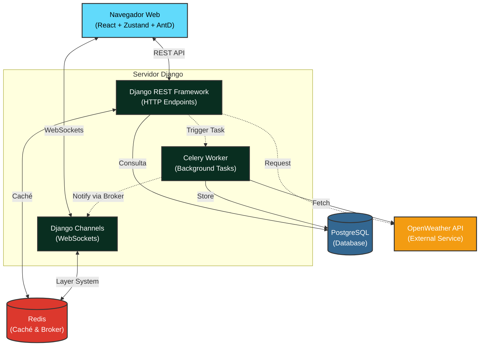

# Enersinc Weather Dashboard

Este proyecto es un Dashboard Climático Full-Stack construido con React (Frontend) y Django (Backend), que permite consultar, comparar y visualizar datos climáticos en tiempo real de diferentes ciudades.

## Arquitectura del Sistema

El siguiente diagrama ilustra el flujo de comunicación y los componentes de infraestructura que sostienen la aplicación:

## Características Principales

1. **Frontend Moderno:** Construido con Vite, React 19 y Ant Design para una experiencia de usuario responsiva.
2. **Estado Resiliente:** Zustand se encarga de persistir el caché local (`localStorage`), lo que permite que el Dashboard funcione de manera fluida incluso si la conexión a internet (`isOffline`) se pierde.
3. **WebSockets y Tiempo Real:** Cuando los datos de clima cambian o son consultados por otros, el backend notifica a todos los clientes a través de Django Channels mediante Redis.
4. **Resiliencia de Conexión:** El frontend utiliza retroceso exponencial (Exponential Backoff) para intentar reconectarse al WebSocket si este falla.
5. **Caching:** Django en su backend usa Redis para reducir la carga hacia la base de datos de PostgreSQL en consultas como `/api/dashboard-data/`.
6. **Robustez ante API Externas:** Si la API de OpenWeather falla temporalmente, el backend automáticamente recurre al último dato conocido en PostgreSQL (Fallback).

## Instrucciones de Uso y Pruebas
- Para arrancar los servicios usa `docker-compose up -d --build`.
- Los endpoints de backend están en `http://localhost:8000/api/`.
- El frontend está en `http://localhost:3000`.
- Para probar el comportamiento offline en el Frontend, ve a DevTools > Network y selecciona "Offline".
