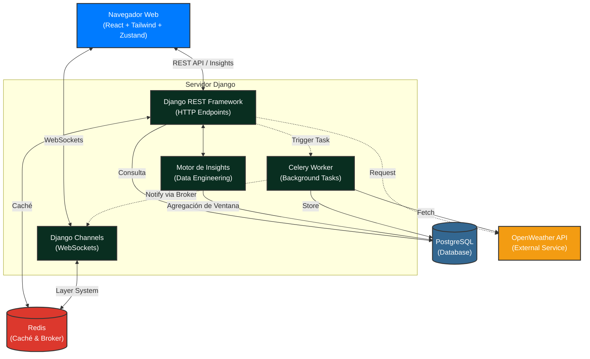

# Plataforma de Telemetría ETRM - Enersinc

Este proyecto es un Dashboard Climático Full-Stack de nivel de producción, diseñado bajo los lineamientos corporativos ETRM (Telemetría y Gestión Energética). Construido con React (Frontend) y Django (Backend), permite consultar, comparar y analizar datos climáticos en tiempo real de diferentes ciudades operativas.

## Arquitectura del Sistema

El siguiente diagrama ilustra el flujo de comunicación y los componentes de infraestructura que sostienen la aplicación:



## Características Principales (Technical Highlights)

1. **Identidad Corporativa ETRM (UI/UX):** 
   - Transición arquitectónica a **Tailwind CSS v4** garantizando un diseño limpio, altamente responsivo y atado a la paleta oficial corporativa de Enersinc.
   - **Modo Oscuro/Claro nativo** controlado vía clase (`class-strategy`) para integrarse sin fricción con los componentes gráficos (Recharts) y la grilla de datos interactiva (Ant Design).

2. **Motor de Insights y Data Engineering:**
   - Construcción de un pipeline aditivo de evaluación en Django (`insights_service.py`) que recopila datos de las últimas 24 horas y computa deltas de temperatura y volatilidad de vientos usando heurísticas y agregación de ventanas.
   - Genera conclusiones automatizadas expuestas a través de WebSockets/API y presentadas en un **carrusel dinámico** en React que realiza rotación de advertencias operativas (Pico Térmico, Vientos, Estabilidad).

3. **Arquitectura Real-Time & Offline First:**
   - **Zustand** intercepta caídas de red y mantiene el Dashboard operativo gracias a un fallback de estado (`isOffline`), restaurando la sesión dinámicamente cuando el cliente reconecta.
   - **WebSockets** asíncronos en Django Channels retransmiten instantáneamente el clima extraído al frontend sin necesidad de recargar la página.

4. **Resiliencia Backend y Caché:**
   - Cacheo activo mediante **Redis** para endpoints pesados (`/api/dashboard-data/`). 
   - Manejo de excepciones para APIS terceras. Si OpenWeather cae, el backend entrega un remanente válido de la base de datos PostgreSQL.

## Instrucciones de Despliegue y Uso

### Despliegue Local (Docker)
Todo el sistema está contenerizado para evitar problemas de compatibilidad:
```bash
# Iniciar infraestructura, base de datos, colas y servidores
docker-compose up -d --build
```
- **Frontend (Vite):** [http://localhost:3000](http://localhost:3000)
- **Backend (API DRF):** [http://localhost:8000/api/](http://localhost:8000/api/)
- **Documentación / Admin:** Opcionalmente expuestos bajo las directivas nativas de Django.

### Pruebas de Resiliencia a evaluar
- **Offline Mode:** Abre DevTools (F12) > Pestaña *Network* > Selecciona *Offline*. Verás alertas persistentes en la UI y el caché reaccionando.
- **Insights Auto-rotativos:** Observa la tarjeta superior del Dashboard; un motor de python ha pre-evaluado condiciones críticas sobre los parámetros térmicos.
- **Dark Mode:** Dispara el botón lunar en el *header*. El motor CSS recalcula la paleta en milisegundos inyectando el rediseño para toda la plataforma (incluyendo la tabla cruda de Ant Design).
